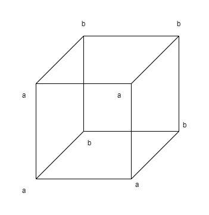
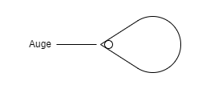

# Fünfter Satz

Der Satz ist eine Wahrheitsfunktion der Elementarsätze.  
(Der Elementarsatz ist eine Wahrheitsfunktion seiner selbst.)

**5.01**
Die Elementarsätze sind die Wahrheitsargumente des Satzes.

**5.02**
Es liegt nahe, die Argumente von Funktionen mit den Indices von Namen zu verwechseln.
Ich erkenne nämlich sowohl am Argument wie am Index die Bedeutung des sie enthaltenden Zeichens.  
In Russells „\\(+_c\\)“ ist z.B. „\\(c\\)“ ein Index, der darauf hinweist, dass das ganze Zeichen das Additionszeichen für Kardinalzahlen ist.
Aber diese Bezeichnung beruht auf willkürlicher Übereinkunft und man könnte statt „\\(+_c\\)“ auch ein einfaches Zeichen wählen; in „\\(\neg p\\)“ aber ist "\\(p\\)" kein Index, sondern ein Argument: der Sinn von „\\(\neg p\\)“  k a n n  n i c h t  verstanden werden, ohne dass vorher der Sinn von „\\(p\\)“ verstanden worden wäre.
(Im Namen Julius Cäsar ist „Julius“ ein Index.
Der Index ist immer ein Teil einer Beschreibung des Gegenstandes, dessen
Namen wir ihn anhängen.
Z. B.  d e r  Cäsar aus dem Geschlechte der Julier.)  
Die Verwechslung von Argument und Index liegt, wenn ich mich nicht irre, der Theorie Freges von der Bedeutung der Sätze und Funktionen zugrunde.
Für Frege waren die Sätze der Logik Namen, und deren Argumente die
Indices dieser Namen.

**5.1**
Die Wahrheitsfunktionen lassen sich in Reihen ordnen.  
Das ist die Grundlage der Wahrscheinlichkeitslehre.

**5.101**
Die Wahrheitsfunktionen jeder Anzahl von Elementarsätzen lassen sich in einem Schema folgender Art hinschreiben:

|   |   |
|---|---|
| \\((WWWW) (p, q)\\) | Tautologie (Wenn \\(p\\), so \\(p\\); und wenn \\(q\\), so \\(q\\).) (\\(p \implies p . q \implies q\\)) |
| \\((F WWW) (p, q)\\) | in Worten: Nicht beides \\(p\\) und \\(q\\). (\\(\neg (p \land q)\\)) |
| \\((WFWW) (p, q)\\) | "_ "______: Wenn \\(q\\), so \\(p\\). (\\(q \implies q\\)) |
| \\((WW FW) (p, q)\\) |"_ "______: Wenn \\(p\\), so \\(q\\). (\\(p \implies q\\)) |
| \\((WWW F) (p, q)\\) | "_ "______: \\(p\\) oder \\(q\\). (\\(p \lor q\\)) |
| \\((F FWW) (p, q)\\) | "_ "______: Nicht \\(q\\). (\\(\neg q\\)) |
| \\((F W FW) (p, q)\\) | "_ "______: Nicht \\(p\\). (\\(\neg p\\)) |
| \\((F WW F) (p, q)\\) | "_ "______: \\(p\\), oder \\(q\\), aber nicht beide. (\\((p \land \neg q) \iff (q \land \neg p)\\)) |
| \\((W F FW) (p, q)\\) | "_ "______: Wenn \\(p\\), so \\(q\\); und wenn \\(q\\), so \\(p\\). (\\(p \iff q\\)) |
| \\((W FW F) (p, q)\\) | "_ "______: \\(p\\) |
| \\((WW F F) (p, q)\\) | "_ "______: \\(q\\) |
| \\((F F FW) (p, q)\\) | "_ "______: Weder \\(p\\) noch \\(q\\). (\\(\neg p \land \neg q\\)) oder (\\(p \lor q) |
| \\((F FW F) (p, q)\\) | "_ "______: \\(p\\) und nicht \\(q\\). (\\(p \land \neg q\\)) |
| \\((F W F F) (p, q)\\) | "_ "______: \\(q\\) und nicht \\(p\\). (\\(q \land \neg p\\)) |
| \\((W F F F) (p, q)\\) | "_ "______: \\(q\\) und \\(p\\). (\\(q \land p\\)) |
| \\((F F F F) (p, q)\\) | Kontradiktion (\\(p\\) und nicht \\(p\\); und \\(q\\) und nicht \\(q\\).) (\\(p \land \neg p \land q \land \neg q\\)) |

Diejenigen Wahrheitsmöglichkeiten seiner Wahrheitsargumente, welche den Satz bewahrheiten, will ich seine  W a h r h e i t s g r ü n d e  nennen.

**5.11**
Sind die Wahrheitsgründe, die einer Anzahl von Sätzen gemeinsam sind, sämtlich auch Wahrheitsgründe eines bestimmten Satzes, so sagen wir, die Wahrheit dieses Satzes folge aus der Wahrheit jener Sätze.

**5.12**
Insbesondere folgt die Wahrheit eines Satzes „\\(p\\)“ aus der Wahrheit eines anderen „\\(q\\)“, wenn alle Wahrheitsgründe des zweiten Wahrheitsgründe des ersten sind.

**5.121**
Die Wahrheitsgründe des einen sind in denen des anderen enthalten; \\(p\\) folgt aus \\(q\\).

**5.122**

Folgt \\(p\\) aus \\(q\\), so ist der Sinn von „\\(p\\)“ im Sinne von „\\(q\\)“ enthalten.

**5.123**
Wenn ein Gott eine Welt erschafft, worin gewisse Sätze wahr sind, so schafft er damit auch schon eine Welt, in welcher alle ihre Folgesätze stimmen.
Und ähnlich könnte er keine Welt schaffen, worin der Satz „\\(p\\)“ wahr ist, ohne seine sämtlichen Gegenstände zu schaffen.

**5.124**
Der Satz bejaht jeden Satz, der aus ihm folgt.

**5.1241**
„\\(p \land q\\)“ ist einer der Sätze, welche „\\(p\\)“ bejahen, und zugleich einer der Sätze, welche „\\(q\\)“ bejahen.  
Zwei Sätze sind einander entgegengesetzt, wenn es keinen sinnvollen Satz gibt, der sie beide bejaht.  
Jeder Satz der einem anderen widerspricht, verneint ihn.

**5.13**
Dass die Wahrheit eines Satzes aus der Wahrheit anderer Sätze folgt, ersehen wir aus der Struktur der Sätze.

**5.131**
Folgt die Wahrheit eines Satzes aus der Wahrheit anderer, so drückt sich dies durch Beziehungen aus, in welchen die Formen jener Sätze zu einander stehen; und zwar brauchen wir sie nicht erst in jene Beziehungen zu setzen, indem wir sie in einem Satz miteinander verbinden, sondern diese Beziehungen sind intern und bestehen, sobald, und dadurch dass, jene
Sätze bestehen.

**5.1311**
Wenn wir von \\(p \lor q\\) und \\(~p\\) auf q schließen, so ist hier durch die Bezeichnungsweise die Beziehung der Satzformen von „p ∨ q“ und „~p“ verhüllt.
Schreiben wir aber z. B. statt „\\(p \lor q\\)“ „\\(p | q .|. p | q \\)“ und statt „\\(~p\\)“ „\\(p | p\\)“ (\\(p | q\\) = weder \\(p\\), noch \\(q\\)), so wird der innere Zusammenhang offenbar.  
(Dass man aus \\((x).fx\\) auf \\(fa\\) schließen kann, das zeigt, dass die Allgemeinheit auch im Symbol „\\((x).fx\\)“ vorhanden ist.)

**5.132**
Folgt \\(p\\) aus \\(q\\), so kann ich von \\(q\\) auf \\(p\\) schließen; \\(p\\) aus \\(q\\) folgern.  
Die Art des Schlusses ist allein aus den beiden Sätzen zu entnehmen.  
Nur sie selbst können den Schluss rechtfertigen.  
„Schlussgesetze“, welche - wie bei Frege und Russell - die Schlüsse rechtfertigen sollen, sind sinnlos, und wären überflüssig.

**5.133**
Alles Folgern geschieht a priori.

**5.134**
Aus einem Elementarsatz lässt sich kein anderer folgern.

**5.135**
Auf keine Weise kann aus dem Bestehen irgend einer Sachlage auf das Bestehen einer von ihr gänzlich verschiedenen Sachlage geschlossen werden.

**5.136**
Einen Kausalnexus, der einen solchen Schluss rechtfertigte, gibt es nicht.

**5.1361**
Die Ereignisse der Zukunft  k ö n n e n  wir nicht aus den gegenwärtigen erschließen.
Der Glaube an den Kausalnexus ist der  A b e r g l a u b e.

**5.1362**
Die Willensfreiheit besteht darin, dass zukünftige Handlungen jetzt nicht gewusst werden können. 
Nur dann könnten wir sie wissen, wenn die Kausalität eine  i n n e r e  Notwendigkeit wäre, wie die des logischen Schlusses. - 
Der Zusammenhang von Wissen und Gewusstem ist der der logischen Notwendigkeit.  
(„\\(A\\) weiß, dass \\(p\\) der Fall ist“ ist sinnlos, wenn \\(q\\) eine Tautologie ist.)

**5.1363**
Wenn daraus, dass ein Satz uns einleuchtet, nicht  f o l g t, dass er wahr ist, so ist das Einleuchten auch keine Rechtfertigung für unseren Glauben an seine Wahrheit.

**5.14**
Folgt ein Satz aus einem anderen, so sagt dieser mehr als jener, jener weniger als dieser. 

**5.141**
Folgt \\(p\\) aus \\(q\\) und \\(q\\) aus \\(p\\), so sind sie ein
und derselbe Satz.

**5.142**
Die Tautologie folgt aus allen Sätzen: sie sagt nichts.

**5.143**
Die Kontradiktion ist das Gemeinsame der Sätze, was  k e i n  Satz mit einem anderen gemein hat.
Die Tautologie ist das Gemeinsame aller Sätze, welche nichts miteinander gemein
haben.  
Die Kontradiktion verschwindet sozusagen außerhalb, die Tautologie innerhalb aller Sätze.  
Die Kontradiktion ist die äußere Grenze der Sätze, die Tautologie ihr substanzloser Mittelpunkt.

**5.15**
Ist \\(W_r\\) die Anzahl der Wahrheitsgründe des Satzes „\\(r\\)“, \\(W_{rs}\\) die Anzahl derjenigen Wahrheitsgründe des Satzes „\\(s\\)“, die zugleich Wahrheitsgründe von „\\(r\\)“ sind, dann nennen wir das Verhältnis: \\(W_{rs} : W_r\\) das Maß der  W a h r s c h e i n l i c h k e i t, welche der Satz „\\(r\\)“ dem Satz „\\(s\\)“ gibt.

**5.151**
Sei in einem Schema wie dem obigen in No. 5.101 \\(W_r\\) die Anzahl der „\\(W\\)“ im Satze \\(r\\); \\(W_{rs}\\) die Anzahl derjenigen „W“ im Satze s, die in gleichen Kolonnen mit „\\(W\\)“ des Satzes \\(r\\) stehen.
Der Satz r gibt dann dem Satze s die Wahrscheinlichkeit: \\(W_{rs} : W_r\\).

**5.1511**
Es gibt keinen besonderen Gegenstand, der den Wahrscheinlichkeitssätzen eigen wäre.

**5.152**
Sätze, welche keine Wahrheitsargumente mit einander gemein haben, nennen wir von einander unabhängig.  
Zwei Elementarsätze geben einander die Wahrscheinlichkeit \\(\frac{1}{2}\\).  
Folgt \\(p\\) aus \\(q\\), so gibt der Satz „\\(q\\)“ dem Satz „\\(p\\)“ die Wahrscheinlichkeit 1.
Die Gewissheit des logischen Schlusses ist ein Grenzfall der
Wahrscheinlichkeit.  
(Anwendung auf Tautologie und Kontradiktion.)

**5.153**
Ein Satz ist an sich weder wahrscheinlich noch unwahrscheinlich.
Ein Ereignis trifft ein, oder es trifft nicht ein, ein Mittelding gibt es nicht.

**5.154**
In einer Urne seien gleichviel weiße und schwarze Kugeln (und keine anderen).
Ich ziehe eine Kugel nach der anderen und lege sie wieder in die Urne zurück.
Dann kann ich durch den Versuch feststellen, dass sich die Zahlen der gezogenen schwarzen und weißen Kugeln bei fortgesetztem Ziehen einander nähern.  
D a s ist also kein mathematisches Faktum.  
Wenn ich nun sage: Es ist gleich wahrscheinlich, dass ich eine weiße Kugel wie eine schwarze ziehen werde, so heißt das:
Alle mir bekannten Umstände (die hypothetisch angenommenen Naturgesetze mitinbegriffen) geben dem Eintreffen des einen Ereignisses nicht m e h r Wahrscheinlichkeit als dem Eintreffen des anderen.
Das heißt, sie geben - wie aus den obigen Erklärungen leicht zu entnehmen ist - jedem die Wahrscheinlichkeit \\(\frac{1}{2}\\).  
Was ich durch den Versuch bestätige ist, dass das Eintreffen der beiden Ereignisse von den Umständen, die ich nicht näher kenne, unabhängig ist.

**5.155**
Die Einheit des Wahrscheinlichkeitssatzes ist: Die Umstände - die ich sonst nicht weiter kenne - geben dem Eintreffen eines bestimmten Ereignisses den und den Grad der Wahrscheinlichkeit.

**5.156**
So ist die Wahrscheinlichkeit eine Verallgemeinerung.  
Sie involviert eine allgemeine Beschreibung einer Satzform.  
Nur in Ermanglung der Gewissheit gebrauchen wir die Wahrscheinlichkeit. - 
Wenn wir zwar eine Tatsache nicht vollkommen kennen, wohl aber e t w a s über ihre Form wissen.  
(Ein Satz kann zwar ein unvollständiges Bild einer gewissen Sachlage sein, aber er ist immer e i n vollständiges Bild.)  
Der Wahrscheinlichkeitssatz ist gleichsam ein Auszug aus anderen Sätzen.

**5.2**
Die Strukturen der Sätze stehen in internen Beziehungen zu einander.

**5.21**
Wir können diese internen Beziehungen dadurch in unserer Ausdrucksweise hervorheben, dass wir einen Satz als Resultat einer Operation darstellen, die ihn aus anderen Sätzen (den Basen der Operation) hervorbringt.

**5.22**
Die Operation ist der Ausdruck einer Beziehung zwischen den Strukturen ihres Resultats
und ihrer Basen.

**5.23**
Die Operation ist das, was mit dem einen Satz geschehen muss, um aus ihm den anderen zu machen.

**5.231**
Und das wird natürlich von ihren formalen Eigenschaften, von der internen Ähnlichkeit ihrer Formen abhängen.

**5.232**
Die interne Relation, die eine Reihe ordnet, ist äquivalent mit der Operation, durch welche ein Glied aus dem anderen entsteht.

**5.233**
Die Operation kann erst dort auftreten, wo ein Satz auf logisch bedeutungsvolle Weise aus einem anderen entsteht. Also dort, wo die logische Konstruktion des Satzes anfängt.

**5.234**
Die Wahrheitsfunktionen der Elementarsätze sind Resultate von Operationen, die die Elementarsätze als Basen haben.
(Ich nenne diese Operationen Wahrheitsoperationen.)

**5.2341**
Der Sinn einer Wahrheitsfunktion von \\(p\\) ist eine Funktion des Sinnes von \\(p\\).  
Verneinung, logische Addition, logische Multiplikation, etc., etc. sind Operationen.  
(Die Verneinung verkehrt den Sinn des Satzes.)

**5.24**
Die Operation zeigt sich in einer Variablen; sie zeigt, wie man von einer Form von Sätzen zu einer anderen gelangen kann.  
Sie bringt den Unterschied der Formen zum Ausdruck.  
(Und das Gemeinsame zwischen den Basen und dem Resultat der Operation sind eben die Basen.)

**5.241**
Die Operation kennzeichnet keine Form, sondern nur den Unterschied der Formen.

**5.242**
Dieselbe Operation, die „\\(q\\)“ aus „\\(p\\)“ macht, macht aus „\\(q\\)“ „\\(r\\)“ u. s. f.
Dies kann nur darin ausgedrückt sein, dass „\\(p\\)“, „\\(q\\)“, „\\(r\\)“, etc. Variable sind, die gewisse formale Relationen allgemein zum Ausdruck bringen.

**5.25**
Das Vorkommen der Operation charakterisiert den Sinn des Satzes nicht.  
Die Operation sagt ja nichts aus, nur ihr Resultat, und dies hängt von den Basen der Operation ab.  
(Operation und Funktion dürfen nicht miteinander verwechselt werden.)

**5.251**
Eine Funktion kann nicht ihr eigenes Argument sein, wohl aber kann das Resultat einer Operation ihre eigene Basis werden.

**5.252**
Nur so ist das Fortschreiten von Glied zu Glied in einer Formenreihe (von Type zu Type in den Hierarchien Russells und Whiteheads) möglich.
(Russell und Whitehead haben die Möglichkeit dieses Fortschreitens nicht zugegeben, aber immer wieder von ihr Gebrauch gemacht.)

**5.2521**
Die fortgesetzte Anwendung einer Operation auf ihr eigenes Resultat nenne ich ihre
successive Anwendung („\\(O'O'O'a\\)“ ist das Resultat der dreimaligen successiven Anwendung
von „\\(O'\xi\\)“ auf „\\(a\\)“).  
In einem ähnlichen Sinne rede ich von der successiven Anwendung m e h r e r e r Operationen auf eine Anzahl von Sätzen.

**5.2522**
Das allgemeine Glied einer Formenreihe \\(a, O'a, O’O’a, \dots\\) schreibe ich daher so:
„\\([a, x, O’ x]\\)“.
Dieser Klammerausdruck ist eine Variable.
Das erste Glied des Klammerausdruckes ist der Anfang der Formenreihe, das zweite die Form eines beliebigen Gliedes \\(x\\) der Reihe und das dritte die Form desjenigen Gliedes der Reihe, welches auf \\(x\\) unmittelbar folgt.

**5.2523**
Der Begriff der successiven Anwendung der Operation ist äquivalent mit dem Begriff „und so weiter“.

**5.253**
Eine Operation kann die Wirkung einer anderen rückgängig machen. Operationen können einander aufheben.

**5.254**
Die Operation kann verschwinden (z. B. die Verneinung in „\\((~~p\\)“: \\(~~p = p\\)).

**5.3**
Alle Sätze sind Resultate von Wahrheitsoperationen mit den Elementarsätzen.  
Die Wahrheitsoperation ist die Art und Weise, wie aus den Elementarsätzen die Wahrheitsfunktion entsteht.  
Nach dem Wesen der Wahrheitsoperation wird auf die gleiche Weise, wie aus den Elementarsätzen ihre Wahrheitsfunktion, aus Wahrheitsfunktionen eine neue.
Jede Wahrheitsoperation erzeugt aus Wahrheitsfunktionen von Elementarsätzen wieder eine Wahrheitsfunktion von Elementarsätzen, einen Satz.
Das Resultat jeder Wahrheitsoperation mit den Resultaten von Wahrheitsoperationen mit Elementarsätzen ist wieder das Resultat E i n e r Wahrheitsoperation mit Elementarsätzen.  
Jeder Satz ist das Resultat von Wahrheitsoperationen mit Elementarsätzen.

**5.31**
Die Schemata No. 4.31 haben auch dann eine Bedeutung, wenn „\\(p\\)“, „\\(q\\)“, „\\(r\\)“, etc. nicht Elementarsätze sind.  
Und es ist leicht zu sehen, dass das Satzzeichen in No. 4.442, auch wenn „\\(p\\)“ und „\\(q\\)“ Wahrheitsfunktionen von Elementarsätzen sind, Eine Wahrheitsfunktion von Elementarsätzen ausdrückt.

**5.32**
Alle Wahrheitsfunktionen sind Resultate der successiven Anwendung einer endlichen Anzahl von Wahrheitsoperationen auf die Elementarsätze.

**5.4**
Hier zeigt es sich, dass es „logische Gegenstände“, „logische Konstante“ (im Sinne Freges und Russells) nicht gibt.

**5.41**
Denn: Alle Resultate von Wahrheitsoperationen mit Wahrheitsfunktionen sind identisch, welche eine und dieselbe Wahrheitsfunktion von Elementarsätzen sind.

**5.42**
Dass \\(\lor\\), \\(\supset\\), etc. nicht Beziehungen im Sinne von rechts und links etc. sind, leuchtet ein.  
Die Möglichkeit des kreuzweisen Definierens der logischen „Urzeichen“ Freges und Russells zeigt schon, dass diese keine Urzeichen sind, und schon erst recht, dass sie keine Relationen bezeichnen.  
Und es ist offenbar, dass das „\\(\supset\\)“, welches wir durch „\\(~\\)“ und „\\(\lor\\)“ definieren, identisch ist mit dem, durch welches wir „\\(\lor\\)“ mit „\\(~\\)“ definieren, und dass dieses „\\(\lor\\)“ mit dem ersten identisch ist.
U. s. w.

**5.43**
Dass aus einer Tatsache p unendlich viele  a n d e r e  folgen sollten, nämlich \\(~~p\\), \\(~~~~p\\), etc., ist doch von vornherein kaum zu glauben.
Und nicht weniger merkwürdig ist, dass die unendliche Anzahl der Sätze der Logik (der Mathematik) aus einem halben Dutzend „Grundgesetzen“ folgen.  
Alle Sätze der Logik sagen aber dasselbe.
Nämlich nichts.

**5.44**
Die Wahrheitsfunktionen sind keine materiellen Funktionen.  
Wenn man z. B. eine Bejahung durch doppelte Verneinung erzeugen kann, ist dann die Verneinung - in irgend einem Sinn - in der Bejahung enthalten? Verneint „\\(~~p\\)“ \\(~p\\), oder bejaht es \\(p\\); oder beides?  
Der Satz „\\(~~p\\)“ handelt nicht von der Verneinung wie von einem Gegenstand; wohl aber ist die Möglichkeit der Verneinung in der Bejahung bereits präjudiziert.  
Und gäbe es einen Gegenstand, der „\\(~\\)“ hieße, so müsste „\\(~~p\\)“ etwas anderes sagen als „\\(p\\)“. Denn der eine Satz würde dann eben von \\(~\\) handeln, der andere nicht.

**5.441**
Dieses Verschwinden der scheinbaren logischen Konstanten tritt auch ein, wenn „\\(~ (\exists x).~f x\\)“ dasselbe sagt wie „\\((x). f x\\)“, oder
„\\((\exists x). f x . x = a\\)“ dasselbe wie „\\(fa\\)“.

**5.442**
Wenn uns ein Satz gegeben ist, so sind  m i t  i h m  auch schon die Resultate aller Wahrheitsoperationen, die ihn zur Basis haben, gegeben.

**5.45**
Gibt es logische Urzeichen, so muss eine richtige Logik ihre Stellung zueinander klar machen und ihr Dasein rechtfertigen.
Der Bau der Logik  a u s  ihren Urzeichen muss klar werden.

**5.451**
Hat die Logik Grundbegriffe, so müssen sie von einander unabhängig sein.
Ist ein Grundbegriff eingeführt, so muss er in allen Verbindungen eingeführt sein, worin er überhaupt vorkommt.
Man kann ihn also nicht zuerst für  e i n e  Verbindung, dann noch einmal für eine andere einführen.
Z. B.: Ist die Verneinung eingeführt, so müssen wir sie jetzt in Sätzen von der Form „\\(~p\\)“ ebenso verstehen, wie in Sätzen
wie „\\(~(p \lor q)\\)“, „\\((\exists x).~f x\\)“ u. a.
Wir dürfen sie nicht erst für die eine Klasse von Fällen, dann für die andere einführen, denn es bliebe dann zweifelhaft, ob ihre Bedeutung in beiden Fällen die gleiche wäre und es wäre kein Grund vorhanden, in beiden Fällen dieselbe Art der Zeichenverbindung zu benützen.  
(Kurz, für die Einführung der Urzeichen gilt, mutatis mutandis, dasselbe, was Frege („Grundgesetze der Arithmetik“) für die Einführung von Zeichen durch Definitionen gesagt hat.)

**5.452**
Die Einführung eines neuen Behelfes in den Symbolismus der Logik muss immer ein folgenschweres Ereignis sein.
Kein neuer Behelf darf in die Logik - sozusagen, mit ganz unschuldiger Miene - in Klammern oder unter dem Striche eingeführt werden.  
(So kommen in den „Principia Mathematica“ von Russell und Whitehead Definitionen und Grundgesetze in Worten vor.
Warum hier plötzlich Worte? Dies bedürfte einer Rechtfertigung.
Sie fehlt und muss fehlen, da das Vorgehen tatsächlich unerlaubt ist.)  
Hat sich aber die Einführung eines neuen Behelfes an einer Stelle als nötig erwiesen, so muss man sich nun sofort fragen:
Wo muss dieser Behelf nun i m m e r angewandt werden?
Seine Stellung in der Logik muss nun erklärt werden.

**5.453**
Alle Zahlen der Logik müssen sich rechtfertigen lassen.  
Oder vielmehr: Es muss sich herausstellen, dass es in der Logik keine Zahlen gibt.  
Es gibt keine ausgezeichneten Zahlen.

**5.454**
In der Logik gibt es kein Nebeneinander, kann es keine Klassifikation geben.  
In der Logik kann es nicht Allgemeineres und Spezielleres geben.

**5.4541**
Die Lösungen der logischen Probleme müssen einfach sein, denn sie setzen den Standard der Einfachheit.  
Die Menschen haben immer geahnt, dass es ein Gebiet von Fragen geben müsse, deren Antworten—a priori—symmetrisch, und zu einem  abgeschlossenen, regelmäßigen Gebilde vereint liegen.  
Ein Gebiet, in dem der Satz gilt: simplex sigillum veri.

**5.46**
Wenn man die logischen Zeichen richtig einführte, so hätte man damit auch schon den Sinn aller ihrer Kombinationen eingeführt; also nicht nur „\\(p \lor q\\)“ sondern auch schon „\\(~(p \lor ~q)\\)“ etc. etc.
Man hätte damit auch schon die Wirkung aller nur möglichen Kombinationen von Klammern eingeführt.
Und damit wäre es klar geworden, dass die eigentlichen allgemeinen Urzeichen nicht die „\\(p \lor q\\)“, „\\((\exists x). f x\\)“, etc. sind, sondern die allgemeinste Form ihrer Kombinationen.

**5.461**
Bedeutungsvoll ist die scheinbar unwichtige Tatsache, dass die logischen Scheinbeziehungen, wie \\(\lor\\) und \\(supset\\), der Klammern bedürfen - im Gegensatz zu den wirklichen Beziehungen.  
Die Benützung der Klammern mit jenen scheinbaren Urzeichen deutet ja schon darauf hin, dass diese nicht die wirklichen Urzeichen
sind.
Und es wird doch wohl niemand glauben, dass die Klammern eine selbständige Bedeutung haben.

**5.4611**
Die logischen Operationszeichen sind Interpunktionen.

**5.47**
Es ist klar, dass alles, was sich überhaupt  v o n  v o r n h e r e i n  über die Form aller Sätze sagen lässt, sich  a u f  e i n m a l  sagen lassen muss.  
Sind ja schon im Elementarsatze alle logischen Operationen enthalten. 
Denn „\\(fa\\)“ sagt dasselbe wie "
\\[(\exists x). f x . x = a\\]
“.
Wo Zusammengesetztheit ist, da ist Argument und Funktion, und wo diese sind, sind bereits alle logischen Konstanten.  
Man könnte sagen: Die Eine logische Konstante ist das, was a l l e Sätze, ihrer Natur nach, mit einander gemein haben.  
Das aber ist die allgemeine Satzform.

**5.471**
Die allgemeine Satzform ist das Wesen des Satzes.

**5.4711**
Das Wesen des Satzes angeben, heißt, das Wesen aller Beschreibung angeben, also das Wesen der Welt.

**5.472**
Die Beschreibung der allgemeinsten Satzform ist die Beschreibung des einen und einzigen allgemeinen Urzeichens der Logik.

**5.473**
Die Logik muss für sich selber sorgen.  
Ein m ö g l i c h e s Zeichen muss auch bezeichnen können.
Alles was in der Logik möglich ist, ist auch erlaubt.
(„Sokrates ist identisch“ heißt darum nichts, weil es keine Eigenschaft gibt, die „identisch“ heißt.
Der Satz ist unsinnig, weil wir eine willkürliche Bestimmung nicht getroffen haben, aber nicht darum, weil das Symbol an und für sich unerlaubt wäre.)  
Wir können uns, in gewissem Sinne, nicht in der Logik irren.

**5.4731**
Das Einleuchten, von dem Russell so viel sprach, kann nur dadurch in der Logik entbehrlich werden, dass die Sprache selbst jeden logischen Fehler verhindert. -
Dass die Logik a priori ist, besteht darin, dass nicht unlogisch
gedacht werden k a n n.

**5.4732**
Wir können einem Zeichen nicht den unrechten Sinn geben.

**5.47321**
Occams Devise ist natürlich keine willkürliche, oder durch ihren praktischen Erfolg gerechtfertigte Regel:
Sie besagt, dass u n n ö t i g e Zeicheneinheiten nichts bedeuten.  
Zeichen, die E i n e n Zweck erfüllen, sind logisch äquivalent, Zeichen, die k e i n e n Zweck erfüllen, logisch bedeutungslos.

**5.4733**
Frege sagt: Jeder rechtmäßig gebildete Satz muss einen Sinn haben; und ich sage:
Jeder mögliche Satz ist rechtmäßig gebildet, und wenn er keinen Sinn hat, so kann das nur daran liegen, dass wir einigen seiner Bestandteile keine B e d e u t u n g gegeben haben.  
(Wenn wir auch glauben, es getan zu haben.)  
So sagt „Sokrates ist identisch“ darum nichts, weil wir dem Wort „identisch“ als E i g e n s c h a f t s w o r t  k e i n e Bedeutung gegeben haben.
Denn, wenn es als Gleichheitszeichen auftritt, so symbolisiert es auf ganz andere Art und Weise - die bezeichnende Beziehung ist eine andere, - also ist auch das Symbol in beiden Fällen ganz verschieden; die beiden Symbole haben nur das Zeichen zufällig miteinander gemein.

**5.474**
Die Anzahl der nötigen Grundoperationen hängt n u r von unserer Notation ab.

**5.475**
Es kommt nur darauf an, ein Zeichensystem von einer bestimmten Anzahl von Dimensionen—von einer bestimmten mathematischen Mannigfaltigkeit—zu bilden.

**5.476**
Es ist klar, dass es sich hier nicht um eine A n z a h l  v o n  G r u n d b e g r i f f e n handelt, die bezeichnet werden müssen, sondern
um den Ausdruck einer Regel.

**5.5**
Jede Wahrheitsfunktion ist ein Resultat der successiven Anwendung der Operation \\((− − − − −W) (\xi, . . . . .)\\) auf Elementarsätze.  
Diese Operation verneint sämtliche Sätze in der rechten Klammer, und ich nenne sie die Negation dieser Sätze.

**5.501**
Einen Klammerausdruck, dessen Glieder Sätze sind, deute ich—wenn die Reihenfolge der Glieder in der Klammer gleichgültig ist - durch ein Zeichen von der Form „\\((\overscore{\xi})\\)“ an.
„\xi“ ist eine Variable, deren Werte die Glieder des Klammerausdruckes sind; und der Strich über der Variablen deutet an, dass sie ihre sämtlichen Werte in der Klammer vertritt.  
(Hat also \\(\xi)\\ etwa die 3 Werte \\(P, Q, R)\\, so ist \\((\overscore{\xi}) = (\overscore{P, Q, R})\\).)  
Die Werte der Variablen werden festgesetzt.  
Die Festsetzung ist die Beschreibung der Sätze, welche die Variable vertritt.  
Wie die Beschreibung der Glieder des Klammerausdruckes geschieht, ist unwesentlich.  
Wir k ö n n e n drei Arten der Beschreibung unterscheiden: 
1. Die direkte Aufzählung. 
In diesem Fall können wir statt der Variablen einfach ihre konstanten Werte setzen.
2. Die Angabe einer Funktion f x, deren Werte für alle Werte von x die zu beschreibenden Sätze sind.
3. Die Angabe eines formalen Gesetzes, nach welchem jene Sätze gebildet sind.
In diesem Falle sind die Glieder des Klammerausdrucks sämtliche Glieder einer Formenreihe.

**5.502**
Ich schreibe also statt „\\((− − − − −W) (\xi, . . . . .)\\)“ „\\(N(\overscore{\xi})\\)“.
\\(N(overscore{\xi})\\) ist die Negation sämtlicher Werte der
Satzvariablen \\(\xi)\\.

**5.503**
Da sich offenbar leicht ausdrücken läßt, wie mit dieser Operation Sätze gebildet werden können und wie Sätze mit ihr nicht zu bilden sind, so muss dies auch einen exakten Ausdruck finden können.

**5.51**
Hat \\(\xi)\\ nur einen Wert, so ist \\(N(\overscore{\xi}) = ~p\\) (nicht
\\(p)\\), hat es zwei Werte, so ist \\(N(\overscore{\xi}) = ~p . ~q\\) (weder \\(p)\\ noch \\(q)\\).

**5.511**
Wie kann die allumfassende, weltspiegelnde Logik so spezielle Haken und Manipulationen gebrauchen?
Nur, indem sich alle diese zu einem unendlich feinen Netzwerk, zu dem großen Spiegel, verknüpfen.

**5.512**
„\\(~p)\\“ ist wahr, wenn „\\(p)\\“ falsch ist.
Also in dem wahren Satz „\\(~p)\\“ ist „\\(p)\\“ ein falscher Satz.
Wie kann ihn nun der Strich „~“ mit der Wirklichkeit zum Stimmen bringen?  
Das, was in „\\(~p)\\“ verneint, ist aber nicht das „\\(~)\\“, sondern dasjenige, was allen Zeichen dieser Notation, welche \\(p)\\ verneinen, gemeinsam ist.  
Also die gemeinsame Regel, nach welcher „\\(~p)\\“, „\\(~~~p\\)“, „\\(~p∨~p\\)“, „\\(~p . ~p\\)“, etc. etc. (ad inf.) gebildet werden.
Und dies Gemeinsame spiegelt die Verneinung wieder.

**5.513**
Man könnte sagen: Das Gemeinsame aller Symbole, die sowohl \\(p)\\ als \\(q)\\ bejahen, ist der Satz „\\(p . q\\)“.
Das Gemeinsame aller Symbole, die entweder \\(p)\\ oder \\(q)\\ bejahen, ist der Satz „\\(p \lor q\\)“.
Und so kann man sagen: Zwei Sätze sind einander entgegengesetzt, wenn sie nichts miteinander gemein haben, und: 
Jeder Satz hat nur ein Negativ, weil es nur einen Satz gibt, der ganz außerhalb seiner liegt. 
Es zeigt sich so auch in Russells Notation, dass „q : p ∨ ~p“ dasselbe sagt wie „\\(q)\\“; dass „\\(p \lor ~p)\\“ nichts sagt.

**5.514**
Ist eine Notation festgelegt, so gibt es in ihr eine Regel, nach der alle \\(p)\\ verneinenden Sätze gebildet werden, eine Regel, nach der alle \\(p)\\ bejahenden Sätze gebildet werden, eine Regel, nach der alle \\(p)\\ oder \\(q)\\ bejahenden Sätze gebildet werden, u. s. f.
Diese Regeln sind den Symbolen äquivalent und in ihnen spiegelt sich ihr Sinn wieder.

**5.515**
Es muss sich an unseren Symbolen zeigen, dass das, was durch „\\(\lor)\\“, „\\(.)\\“, etc. miteinander verbunden ist, Sätze sein müssen.  
Und dies ist auch der Fall, denn das Symbol „\\(p)\\“ und „\\(q)\\“ setzt ja selbst das „\\(\lor)\\“, „\\(~)\\“, etc. voraus.
Wenn das Zeichen „\\(p)\\“ in „\\(p \lor q)\\“ nicht für ein komplexes Zeichen steht, dann kann es allein nicht Sinn haben; dann können aber auch die mit „\\(p)\\“ gleichsinnigen Zeichen „\\(p \lor p\\)“, „\\(p . p\\)“, etc. keinen Sinn haben. Wenn aber „\\(p \lor p)\\“ keinen Sinn hat, dann kann auch „\\(p \lor q)\\“ keinen Sinn haben.

**5.5151**
Muss das Zeichen des negativen Satzes mit dem Zeichen des positiven gebildet werden?
Warum sollte man den negativen Satz nicht durch eine negative Tatsache ausdrücken können.
(Etwa: Wenn „\\(a)\\“ nicht in einer bestimmten Beziehung zu „\\(b)\\“ steht, könnte das ausdrücken, dass \\(aRb\\) nicht der Fall ist.)  
Aber auch hier ist ja der negative Satz indirekt durch den positiven gebildet.  
Der positive S a t z muss die Existenz des negativen S a t z e s voraussetzen und umgekehrt.

**5.52**
Sind die Werte von \\(\xi\\) sämtliche Werte einer
Funktion \\(f x\\) für alle Werte von \\(x\\), so wird \\(N(\overscore{\xi}) = ~(\exists x). f x\\).

**5.521**
Ich trenne den Begriff A l l e von der Wahrheitsfunktion.  
Frege und Russell haben die Allgemeinheit in Verbindung mit dem logischen Produkt oder der logischen Summe eingeführt.
So wurde es schwer, die Sätze „\\((\exists x). f x\\)“ und „\\((x). f x\\)“, in welchen beide Ideen beschlossen liegen, zu verstehen.

**5.522**
Das Eigentümliche der Allgemeinheitsbezeichnung ist erstens, dass sie auf ein logisches Urbild hinweist, und zweitens, dass sie Konstante hervorhebt.

**5.523**
Die Allgemeinheitsbezeichnung tritt als Argument auf.

**5.524**
Wenn die Gegenstände gegeben sind, so sind uns damit auch schon a l l e Gegenstände gegeben.  
Wenn die Elementarsätze gegeben sind, so sind damit auch a l l e Elementarsätze gegeben.

**5.525**
Es ist unrichtig, den Satz „\\((\exists x). f x\\)“ - wie Russell dies tut - in Worten durch „\\(f x\\) ist m ö g l i c h“ wiederzugeben.  
Gewißheit, Möglichkeit oder Unmöglichkeit einer Sachlage wird nicht durch einen Satz ausgedrückt, sondern dadurch, dass ein Ausdruck eine Tautologie, ein sinnvoller Satz oder eine Kontradiktion ist.  
Jener Präzedenzfall, auf den man sich immer berufen möchte, muss schon im Symbol selber liegen.

**5.526**
Man kann die Welt vollständig durch vollkommen verallgemeinerte Sätze beschreiben, das heißt also, ohne irgendeinen Namen von vornherein einem bestimmten Gegenstand zuzuordnen.  
Um dann auf die gewöhnliche Ausdrucksweise zu kommen, muss man einfach nach einem Ausdruck: „Es gibt ein und nur ein \\(x\\), welches . . . “ sagen: Und dies \\(x\\) ist \\(a\\).

**5.5261**
Ein vollkommen verallgemeinerter Satz ist, wie jeder andere Satz, zusammengesetzt.
(Dies zeigt sich daran, dass wir in „\\((\exists x,\pi).\pi x\\)“ „\\(\pi\\)“ und „\\(x\\)“ getrennt erwähnen müssen.
Beide stehen unabhängig in bezeichnenden Beziehungen zur Welt, wie im unverallgemeinerten Satz.)  
Kennzeichen des zusammengesetzten Symbols:
Es hat etwas mit a n d e r e n Symbolen gemeinsam.

**5.5262**
Es verändert ja die Wahr- oder Falschheit j e d e s Satzes etwas am allgemeinen Bau der Welt.
Und der Spielraum, welcher ihrem Bau durch die Gesamtheit der Elementarsätze gelassen wird, ist eben derjenige, welchen die ganz allgemeinen Sätze begrenzen.  
(Wenn ein Elementarsatz wahr ist, so ist damit doch jedenfalls Ein Elementarsatz  m e h r  wahr.)

**5.53**
Gleichheit des Gegenstandes drücke ich durch Gleichheit des Zeichens aus, und nicht mit Hilfe eines Gleichheitszeichens.
Verschiedenheit der Gegenstände durch Verschiedenheit der Zeichen.

**5.5301**
Dass die Identität keine Relation zwischen Gegenständen ist, leuchtet ein.
Dies wird sehr klar, wenn man z. B. den Satz „\\((x): f x .\supset . x = a\\)“ betrachtet.
Was dieser Satz sagt, ist einfach, dass  n u r  \\(a\\) der Funktion \\(f\\) genügt, und nicht, dass nur solche Dinge der Funktion \\(f\\) genügen, welche eine gewisse Beziehung zu a haben.  
Man könnte nun freilich sagen, dass eben n u r \\(a\\) diese Beziehung zu \\(a\\) habe, aber, um dies auszudrücken, brauchten wir das Gleichheitszeichen selber.

**5.5302**
Russells Definition von „\\(=\\)“ genügt nicht; weil man nach ihr nicht sagen kann, dass zwei Gegenstände alle Eigenschaften gemeinsam haben.
(Selbst wenn dieser Satz nie richtig ist, hat er doch S i n n.)

**5.5303**
Beiläufig gesprochen: Von z w e i Dingen zu sagen, sie seien identisch, ist ein Unsinn, und von E i n e m zu sagen, es sei identisch
mit sich selbst, sagt gar nichts.

**5.531**
Ich schreibe also nicht „\\(f (a,b) . a = b\\)“, sondern „\\(f (a,a)\\)“ (oder „\\(f (b,b)\\)“).
Und nicht „\\(f (a,b) . ~a = b\\)“, sondern „\\(f (a,b)\\)“.

**5.532**
Und analog: Nicht „\\((\exists x, y). f (x, y) . x = y\\)“, sondern „\((\exists x). f (x, x)\\)“; und nicht „\\((\exists x, y). f (x, y) . ~x = y\\)“, sondern „\\((\exists x, y). f (x, y)\)“.  
(Also statt des Russellschen „\\((\exists x, y). f (x, y)\\)“: „\\((\exists x, y). f (x, y) .\lor . (\exists x). f (x, x)\\)“.)

**5.5321**
Statt „\\((x): f x \supset  x = a\\)“ schreiben wir also z. B. „\\((\exists x). f x .\supset . fa : ~(\exists x, y). f x . f y\\)“.  
Und der Satz: „n u r Ein \\(x\\) befriedigt \\(f ( )\\)“ lautet: „\\((\exists x). f x .\supset . fa : ~(\exists x, y). f x . f y\\)“.

**5.533**
Das Gleichheitszeichen ist also kein wesentlicher Bestandteil der Begriffsschrift.

**5.534**
Und nun sehen wir, dass Scheinsätze wie: „\\(a = a\\)“, „\\(a = b . b = c .\supset  a = c\\)“, „\\((x). x = x\\)“, „\\((\exists x). x = a\\)“, etc. sich in einer richtigen Begriffsschrift gar nicht hinschreiben lassen.

**5.535**
Damit erledigen sich auch alle Probleme, die an solche Scheinsätze geknüpft waren.  
Alle Probleme, die Russells „Axiom of Infinity“ mit sich bringt, sind schon hier zu lösen.  
Das, was das Axiom of Infinity sagen soll, würde sich in der Sprache dadurch ausdrücken, dass es unendlich viele Namen mit verschiedener Bedeutung gäbe.

**5.5351**
Es gibt gewisse Fälle, wo man in Versuchung gerät, Ausdrücke von der Form „\\(a = a\\)“ oder „\\(p \supset  p\\)“ u. dgl. zu benützen.
Und zwar geschieht dies, wenn man von dem Urbild: Satz, Ding, etc. reden möchte.
So hat Russell in den „Principles of Mathematics“ den Unsinn „\\(p\\) ist ein Satz“ in Symbolen durch „\\(p \supset p\\)“ wiedergegeben und als Hypothese vor gewisse Sätze gestellt, damit deren Argumentstellen nur von Sätzen besetzt werden könnten.  
(Es ist schon darum Unsinn, die Hypothese \\(p \supset p\\) vor einen Satz zu stellen, um ihm Argumente der richtigen Form zu sichern, weil die Hypothese für einen Nicht-Satz als Argument nicht falsch, sondern unsinnig wird, und weil der Satz selbst durch die unrichtige Gattung von Argumenten unsinnig wird, also sich selbst ebenso gut, oder so schlecht, vor den unrechten Argumenten bewahrt wie die zu diesem Zweck angehängte sinnlose Hypothese.)

**5.5352**
Ebenso wollte man „Es gibt keine D i n g e“ ausdrücken durch „\\(~(\exists x). x = x\\)“.
Aber selbst wenn dies ein Satz wäre - wäre er nicht auch wahr, wenn es zwar „Dinge gäbe“, aber diese nicht mit sich selbst identisch wären?

**5.54**
In der allgemeinen Satzform kommt der Satz im Satze nur als Basis der Wahrheitsoperationen vor.

**5.541**
Auf den ersten Blick scheint es, als könne ein Satz in einem anderen auch auf andere Weise vorkommen.  
Besonders in gewissen Satzformen der Psychologie, wie „\\(A\\) glaubt, dass \\(p\\) der Fall ist“, oder „\\(A\\) denkt \\(p\\)“, etc.  
Hier scheint es nämlich oberflächlich, als stünde der Satz \\(p\\) zu einem Gegenstand \\(A\\) in einer Art von Relation.  
(Und in der modernen Erkenntnistheorie (Russell, Moore, etc.) sind jene Sätze auch so aufgefasst worden.)

**5.542**
Es ist aber klar, dass „\\(A\\) glaubt, dass \\(p\\)“, „\\(A\\) denkt \\(p\\)“, „\\(A\\) sagt \\(p\\)“ von der Form „'\\(p\\)' sagt \\(p\\)“ sind: Und hier handelt es sich nicht um eine Zuordnung von einer Tatsache und einem Gegenstand, sondern um die Zuordnung von Tatsachen durch Zuordnung ihrer Gegenstände.

**5.5421**
Dies zeigt auch, dass die Seele - das Subjekt etc. - wie sie in der heutigen oberflächlichen Psychologie aufgefasst wird, ein Unding ist.  
Eine zusammengesetzte Seele wäre nämlich keine Seele mehr.

**5.5422**
Die richtige Erklärung der Form des Satzes „\\(A\\) urteilt \\(p\\)“ muss zeigen, dass es unmöglich ist, einen Unsinn zu urteilen.
(Russells Theorie genügt dieser Bedingung nicht.)

**5.5423**
Einen Komplex wahrnehmen heißt wahrnehmen, dass sich seine Bestandteile so und so zu einander verhalten.  
Dies erklärt wohl auch, dass man die Figur

auf zweierlei Art als Würfel sehen kann; und alle ähnlichen Erscheinungen.
Denn wir sehen eben wirklich zwei verschiedene Tatsachen.  
(Sehe ich erst auf die Ecken \\(a\\) und nur flüchtig auf \\(b\\), so erscheint \\(a\\) vorne; und umgekehrt.)

**5.55**
Wir müssen nun die Frage nach allen möglichen Formen der Elementarsätze a priori beantworten.  
Der Elementarsatz besteht aus Namen.
Da wir aber die Anzahl der Namen von verschiedener Bedeutung nicht angeben können, so können wir auch nicht die Zusammensetzung des Elementarsatzes angeben.

**5.551**
Unser Grundsatz ist, dass jede Frage, die sich überhaupt durch die Logik entscheiden läßt, sich ohne weiteres entscheiden lassen muss.  
(Und wenn wir in die Lage kommen, ein solches Problem durch Ansehen der Welt beantworten zu müssen, so zeigt dies, dass wir auf grundfalscher Fährte sind.)

**5.552**
Die „Erfahrung“, die wir zum Verstehen der Logik brauchen, ist nicht die, dass sich etwas so und so verhält, sondern, dass etwas i s t: aber das ist eben k e i n e Erfahrung.  
Die Logik ist v o r jeder Erfahrung - dass etwas s o ist.  
Sie ist vor dem Wie, nicht vor dem Was.

**5.5521**
Und wenn dies nicht so wäre, wie könnten wir die Logik anwenden?
Man könnte sagen: Wenn es eine Logik gäbe, auch wenn es keine Welt gäbe, wie könnte es dann eine Logik geben, da es eine Welt gibt?

**5.553**
Russell sagte, es gäbe einfache Relationen zwischen verschiedenen Anzahlen von Dingen (Individuals).
Aber zwischen welchen Anzahlen?
Und wie soll sich das entscheiden? - 
Durch die Erfahrung?  
(Eine ausgezeichnete Zahl gibt es nicht.)

**5.554**
Die Angabe jeder speziellen Form wäre vollkommen willkürlich.

**5.5541**
Es soll sich a priori angeben lassen, ob ich z. B. in die Lage kommen kann, etwas mit dem Zeichen einer 27-stelligen Relation bezeichnen zu müssen.

**5.5542**
Dürfen wir denn aber überhaupt so fragen?
Können wir eine Zeichenform aufstellen und nicht wissen, ob ihr etwas entsprechen könne?  
Hat die Frage einen Sinn: Was muss s e i n, damit etwas der-Fall-sein kann?

**5.555**
Es ist klar, wir haben vom Elementarsatz einen Begriff, abgesehen von seiner besonderen logischen Form.  
Wo man aber Symbole nach einem System bilden kann, dort ist dieses System das logisch wichtige und nicht die einzelnen Symbole.  
Und wie wäre es auch möglich, dass ich es in der Logik mit Formen zu tun hätte, die ich erfinden kann; sondern mit dem muss ich es zu tun haben, was es mir möglich macht, sie zu erfinden.

**5.556**
Eine Hierarchie der Formen der Elementarsätze kann es nicht geben.
Nur was wir selbst konstruieren, können wir voraussehen.

**5.5561**
Die empirische Realität ist begrenzt durch die Gesamtheit der Gegenstände.
Die Grenze zeigt sich wieder in der Gesamtheit der Elementarsätze.  
Die Hierarchien sind, und müssen unabhängig von der Realität sein.

**5.5562**
Wissen wir aus rein logischen Gründen, dass es Elementarsätze geben muss, dann muss es jeder wissen, der die Sätze in ihrer unanalysierten Form versteht.

**5.5563**
Alle Sätze unserer Umgangssprache sind tatsächlich, so wie sie sind, logisch vollkommen geordnet. -
Jenes Einfachste, was wir hier angeben sollen, ist nicht ein Gleichnis der Wahrheit, sondern die volle Wahrheit selbst.  
(Unsere Probleme sind nicht abstrakt, sondern vielleicht die konkretesten, die es gibt.)

**5.557**
Die A n w e n d u n g der Logik entscheidet darüber, welche Elementarsätze es gibt.  
Was in der Anwendung liegt, kann die Logik nicht vorausnehmen.  
Das ist klar: Die Logik darf mit ihrer Anwendung nicht kollidieren.  
Aber die Logik muss sich mit ihrer Anwendung berühren.  
Also dürfen die Logik und ihre Anwendung einander nicht übergreifen.

**5.5571**
Wenn ich die Elementarsätze nicht a priori angeben kann, dann muss es zu offenbarem Unsinn führen, sie angeben zu wollen.

**5.6**
D i e  G r e n z e n  m e i n e r  S p r a c h e bedeuten die Grenzen meiner Welt.

**5.61**
Die Logik erfüllt die Welt; die Grenzen der Welt sind auch ihre Grenzen.  
Wir können also in der Logik nicht sagen:
Das und das gibt es in der Welt, jenes nicht.  
Das würde nämlich scheinbar voraussetzen, dass wir gewisse Möglichkeiten ausschließen, und dies kann nicht der Fall sein, da sonst die Logik über die Grenzen der Welt hinaus müsste; wenn sie nämlich diese Grenzen auch von der anderen Seite betrachten könnte.  
Was wir nicht denken können, das können wir nicht denken; wir können also auch nicht s a g e n, was wir nicht denken können.

**5.62**
Diese Bemerkung gibt den Schlüssel zur Entscheidung der Frage, inwieweit der Solipsismus eine Wahrheit ist.  
Was der Solipsismus nämlich m e i n t, ist ganz richtig, nur lässt es sich nicht s a g e n, sondern es zeigt sich.  
Dass die Welt m e i n e Welt ist, das zeigt sich darin, dass die Grenzen d e r Sprache (der Sprache, die allein ich verstehe) die Grenzen m e i n e r Welt bedeuten.

**5.621**
Die Welt und das Leben sind Eins.

**5.63**
Ich bin meine Welt. (Der Mikrokosmos.)

**5.631**
Das denkende, vorstellende, Subjekt gibt es nicht.  
Wenn ich ein Buch schriebe „Die Welt, wie ich sie vorfand“, so wäre darin auch über meinen Leib zu berichten und zu sagen, welche Glieder meinem Willen unterstehen und welche nicht, etc., dies ist nämlich eine Methode, das Subjekt zu isolieren, oder vielmehr zu zeigen, dass es in einem wichtigen Sinne kein Subjekt gibt: 
Von ihm allein nämlich könnte in diesem Buche n i c h t die Rede sein.—

**5.632**
Das Subjekt gehört nicht zur Welt, sondern es ist eine Grenze der Welt.

**5.633**
Wo i n der Welt ist ein metaphysisches Subjekt zu merken?  
Du sagst, es verhält sich hier ganz wie mit Auge und Gesichtsfeld.
Aber das Auge siehst du wirklich n i c h t.  
Und nichts a m G e s i c h t s f e l d lässt darauf schließen, dass es von einem Auge gesehen wird.

**5.6331**
Das Gesichtsfeld hat nämlich nicht etwa eine solche Form:

**5.634**
Das hängt damit zusammen, dass kein Teil unserer Erfahrung auch a priori ist.  
Alles, was wir sehen, könnte auch anders sein.  
Alles, was wir überhaupt beschreiben können, könnte auch anders sein.  
Es gibt keine Ordnung der Dinge a priori.

**5.64**
Hier sieht man, dass der Solipsismus, streng durchgeführt, mit dem reinen Realismus zusammenfällt.
Das Ich des Solipsismus schrumpft zum ausdehnungslosen Punkt zusammen, und es bleibt die ihm koordinierte Realität.

**5.641**
Es gibt also wirklich einen Sinn, in welchem in der Philosophie nichtpsychologisch vom Ich die Rede sein kann.  
Das Ich tritt in die Philosophie dadurch ein, dass „die Welt meine Welt ist“.  
Das philosophische Ich ist nicht der Mensch, nicht der menschliche Körper, oder die menschliche Seele, von der die Psychologie handelt, sondern das metaphysische Subjekt, die Grenze - nicht ein Teil - der Welt.