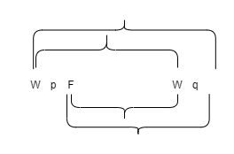
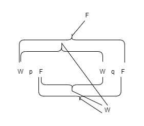
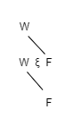
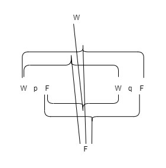
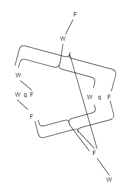
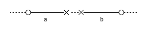

# Sexter Satz

Die allgemeine Form der Wahrheitsfunktion
ist: \\([\bar{p}, \bar{\xi}, N(\bar{\xi})]\\).  
Dies ist die allgemeine Form des Satzes.

**6.001**
Dies sagt nichts anderes, als dass jeder Satz ein Resultat der successiven Anwendung der Operation \\(N'(\bar{\xi})\\) auf die Elementarsätze ist.

**6.002**
Ist die allgemeine Form gegeben, wie ein
Satz gebaut ist, so ist damit auch schon die
allgemeine Form davon gegeben, wie aus einem
Satz durch eine Operation ein anderer erzeugt
werden kann.

**6.01**
Die allgemeine Form der Operation \\(\Omega'(\bar{\eta})\\) ist also: \\([\bar{\xi}, N(\bar{\xi})]'(\bar{\eta}) (= [\bar{\eta}, \bar{\xi} , N(\bar{\xi})])\\).  
Das ist die allgemeinste Form des Überganges von einem Satz zum anderen.

**6.02**
Und s o kommen wir zu den Zahlen: Ich definiere

\\[x = \Omega\^0 ' x, \Omega '\Omega ' x, \Omega '\Omega '\Omega ' x, \dots \\]

\\[x = \Omega^{0} ' x \text{ Def.}\\]

und

\\[\Omega' \Omega^v' x = \Omega^{v+1}' x \text{Def.} \\]

Nach diesen Zeichenregeln schreiben wir also die Reihe

\\[x, \Omega ' x, \Omega '\Omega ' x, \Omega '\Omega '\Omega ' x, \dots \\]

so:

\\[\Omega^0 ' x, \Omega^{0+1}' x, \Omega^{0+1+1}' x, \Omega^{0+1+1+1}' x,\dots\\]

Also schreibe ich statt „\\([x, \xi , \Omega '\xi ]\\)“:
\\[„[\Omega^0' x, \Omega^ν ' x, \Omega^{ν+1}' x]“ \\].
Und definiere:
\\[0+1 = 1 \text{ Def.}\\]
\\[0+1+1 = 2 \text{ Def.}\\]
\\[0+1+1+1 = 3 \text{ Def.}\\]
(u. s. f.)

**6.021**
Die Zahl ist der Exponent einer Operation.

**6.022**
Der Zahlbegriff ist nichts anderes als das Gemeinsame aller Zahlen, die allgemeine Form der Zahl.  
Der Zahlbegriff ist die variable Zahl.  
Und der Begriff der Zahlengleichheit ist die allgemeine Form aller speziellen Zahlengleichheiten.

**6.03**
Die allgemeine Form der ganzen Zahl ist:
\\([0,\xi ,\xi + 1]\\).

**6.031**
Die Theorie der Klassen ist in der Mathematik ganz überflüssig.
Dies hängt damit zusammen, dass die Allgemeinheit, welche wir in der Mathematik brauchen, nicht die z u f ä l l i g e ist.

**6.1**
Die Sätze der Logik sind Tautologien.

**6.11**
Die Sätze der Logik sagen also nichts. (Sie sind die analytischen Sätze.)

**6.111**
Theorien, die einen Satz der Logik gehaltvoll erscheinen lassen, sind immer falsch.
Man könnte z. B. glauben, dass die Worte „wahr“ und „falsch“ zwei Eigenschaften unter anderen Eigenschaften bezeichnen, und da erschiene es als eine merkwürdige Tatsache, dass jeder Satz eine dieser Eigenschaften besitzt.
Das scheint nun nichts weniger als selbstverständlich zu sein, ebensowenig selbstverständlich, wie etwa der Satz: „Alle Rosen sind entweder gelb oder rot“ klänge, auch wenn er wahr wäre.
Ja, jener Satz bekommt nun ganz den Charakter eines naturwissenschaftlichen Satzes, und dies ist das sichere Anzeichen dafür, dass er falsch aufgefasst wurde.

**6.112**
Die richtige Erklärung der logischen Sätze muss ihnen eine einzigartige Stellung unter allen Sätzen geben.

**6.113**
Es ist das besondere Merkmal der logischen Sätze, dass man am Symbol allein erkennen kann, dass sie wahr sind, und diese Tatsache schließt die ganze Philosophie der Logik in sich.
Und so ist es auch eine derwichtigsten Tatsachen, dass sich die Wahrheit oder Falschheit der nichtlogischen Sätze n i c h t am Satz allein erkennen lässt.

**6.12**
Dass die Sätze der Logik Tautologien sind, das z e i g t die formalen - logischen - Eigenschaften der Sprache, der Welt.  
Dass ihre Bestandteile s o verknüpft eine Tautologie ergeben, das charakterisiert die Logik ihrer Bestandteile.  
Damit Sätze, auf bestimmte Art und Weise verknüpft, eine Tautologie ergeben, dazu müssen sie bestimmte Eigenschaften der Struktur haben.
Dass sie s o verbunden eine Tautologie ergeben, zeigt also, dass sie diese Eigenschaften der Struktur besitzen.

**6.1201**
Dass z. B. die Sätze „\\(p\\)“ und „\\(\sim p\\)“ in der Verbindung „\\(\sim (p . \sim p)\\)“ eine Tautologie ergeben, zeigt, dass sie einander widersprechen.
Dass die Sätze „\\(p \supset q\\)“, „\\(p\\)“ und „\\(q\\)“ in der Form „\\((p \supset q) . (p) :\supset: (q)\\)“ miteinander verbunden eine Tautologie ergeben, zeigt, dass \\(q\\) aus \\(p\\) und \\(p \supset q\\) folgt. Dass „\\((x). f x :\supset: fa\\)“ eine Tautologie ist, dass fa aus (x). f x folgt. etc. etc.

**6.1202**
Es ist klar, dass man zu demselben Zweck statt der Tautologien auch die Kontradiktionen verwenden könnte.

**6.1203**
Um eine Tautologie als solche zu erkennen, kann man sich, in den Fällen, in welchen in der Tautologie keine Allgemeinheitsbezeichnung vorkommt, folgender anschaulichen Methode bedienen: Ich schreibe statt „\\(p\\)“, „\\(q\\)“, „\\(r\\)“ etc. „\\(W pF\\)“, „\\(WqF\\)“, „\\(WrF\\)“ etc.
Die Wahrheitskombinationen drücke ich durch Klammern aus, z. B.:

und die Zuordnung der Wahr- oder Falschheit des ganzen Satzes und der Wahrheitskombinationen der Wahrheitsargumente durch Striche auf folgende Weise:

Dies Zeichen würde also z. B. den Satz \\(p \supset q\\) darstellen.
Nun will ich z. B. den Satz \\(\sim (p . \sim p)\\) (Gesetz des Widerspruchs) daraufhin untersuchen, ob er eine Tautologie ist.
Die Form „\\(\sim \xi\\)“ wird in unserer Notation

geschrieben; die Form „\\(\xi  . \eta\\)“ so:

Daher lautet der Satz \\(\sim (p . \sim q)\\) so:

Setzen wir statt „\\(q\\)“ „\\(p\\)“ ein und untersuchen die Verbindung der äußersten W und F mit den innersten, so ergibt sich, dass die Wahrheit des ganzen Satzes a l l e n Wahrheitskombinationen seines Argumentes, seine Falschheit keiner der Wahrheitskombinationen zugeordnet ist.

**6.121**
Die Sätze der Logik demonstrieren die logischen Eigenschaften der Sätze, indem sie sie zu nichtssagenden Sätzen verbinden.  
Diese Methode könnte man auch eine Nullmethode nennen.
Im logischen Satz werden Sätze miteinander ins Gleichgewicht gebracht und der Zustand des Gleichgewichts zeigt dann an, wie diese Sätze logisch beschaffen sein müssen.

**6.122**
Daraus ergibt sich, dass wir auch ohne die logischen Sätze auskommen können, da wir ja in einer entsprechenden Notation die formalen Eigenschaften der Sätze durch das bloße Ansehen dieser Sätze erkennen können.

**6.1221**
Ergeben z. B. zwei Sätze „\\(p\\)“ und „\\(q\\)“ in der Verbindung „\\(p \supset q\\)“ eine Tautologie, so ist klar, dass \\(q\\) aus \\(p\\) folgt.  
Dass z. B. „\\(q\\)“ aus „\\(p \supset q . p\\)“ folgt, ersehen wir aus diesen beiden Sätzen selbst, aber wir können es auch s o zeigen, indem wir sie zu „\\(p \supset q . p :\supset: q\\)“ verbinden und nun zeigen, dass dies eine Tautologie ist.

**6.1222**
Dies wirft ein Licht auf die Frage, warum die logischen Sätze nicht durch die Erfahrung bestätigt werden können, ebensowenig wie sie durch die Erfahrung widerlegt werden können.
Nicht nur muss ein Satz der Logik durch keine mögliche Erfahrung widerlegt werden können, sondern er darf auch nicht durch eine solche bestätigt werden können.

**6.1223**
Nun wird klar, warum man oft fühlte, als wären die „logischen Wahrheiten“ von uns zu „f o r d e r n“: Wir können sie nämlich insofern fordern, als wir eine genügende Notation fordern können.

**6.1224**
Es wird jetzt auch klar, warum die Logik die Lehre von den Formen und vom Schließen genannt wurde.

**6.123**
Es ist klar: Die logischen Gesetze dürfen nicht selbst wieder logischen Gesetzen unterstehen.  
(Es gibt nicht, wie Russell meinte, für jede „Type“ ein eigenes Gesetz des Widerspruches, sondern Eines genügt, da es auf sich selbst nicht angewendet wird.)

**6.1231**
Das Anzeichen des logischen Satzes ist n i c h t die Allgemeingültigkeit.  
Allgemein sein heißt ja nur: zufälligerweise für alle Dinge gelten. Ein unverallgemeinerter Satz kann ja ebensowohl tautologisch sein als ein verallgemeinerter.

**6.1232**
Die logische Allgemeingültigkeit könnte man wesentlich nennen, im Gegensatz zu jener zufälligen, etwa des Satzes: „Alle Menschen sind sterblich“.
Sätze wie Russells „Axiom of Reducibility“ sind nicht logische Sätze, und dies erklärt unser Gefühl: 
Dass sie, wenn wahr, so doch nur durch einen günstigen Zufall wahr sein könnten.

**6.1233**
Es lässt sich eine Welt denken, in der das Axiom of Reducibility nicht gilt.
Es ist aber klar, dass die Logik nichts mit der Frage zu schaffen hat, ob unsere Welt wirklich so ist oder nicht.

**6.124**
Die logischen Sätze beschreiben das Gerüst der Welt, oder vielmehr, sie stellen es dar.
Sie „handeln“ von nichts.
Sie setzen voraus, dass Namen Bedeutung, und Elementarsätze Sinn haben: Und dies ist ihre Verbindung mit der Welt.
Es ist klar, dass es etwas über die Welt anzeigen muss, dass gewisse Verbindungen von Symbolen - welche wesentlich einen bestimmten Charakter haben—Tautologien sind.
Hierin liegt das Entscheidende.
Wir sagten, manches an den Symbolen, die wir gebrauchen, wäre
willkürlich, manches nicht.
In der Logik drückt nur dieses aus:
Das heißt aber, in der Logik drücken nicht w i r mit Hilfe der Zeichen aus, was wir wollen, sondern in der Logik sagt die Natur der naturnotwendigen Zeichen selbst aus:
Wenn wir die logische Syntax irgendeiner Zeichensprache kennen, dann sind bereits alle Sätze der Logik gegeben.

**6.125**
Es ist möglich, und zwar auch nach der alten Auffassung der Logik, von vornherein eine Beschreibung aller „wahren“ logischen Sätze zu geben.

**6.1251**
Darum kann es in der Logik auch n i e Überraschungen geben.

**6.126**
Ob ein Satz der Logik angehört, kann man berechnen, indem man die logischen Eigenschaften des S y m b o l s berechnet.  
Und dies tun wir, wenn wir einen logischen Satz „beweisen“. Denn, ohne uns um einen Sinn und eine Bedeutung zu kümmern, bilden wir den logischen Satz aus anderen nach bloßen Z e i c h e n r e g e l n.  
Der Beweis der logischen Sätze besteht darin, dass wir sie aus anderen logischen Sätzen durch successive Anwendung gewisser Operationen entstehen lassen, die aus den ersten immer wieder Tautologien erzeugen.
(Und zwar  f o l g e n  aus einer Tautologie nur Tautologien.)  
Natürlich ist diese Art zu zeigen, dass ihre Sätze Tautologien sind, der Logik durchaus unwesentlich.
Schon darum, weil die Sätze, von welchen der Beweis ausgeht, ja ohne Beweis zeigen müssen, dass sie Tautologien sind.

**6.1261**
In der Logik sind Prozess und Resultat äquivalent.
(Darum keine Überraschung.)

**6.1262**
Der Beweis in der Logik ist nur ein mechanisches Hilfsmittel zum leichteren Erkennen der Tautologie, wo sie kompliziert ist.

**6.1263**
Es wäre ja auch zu merkwürdig, wenn man einen sinnvollen Satz l o g i s c h aus anderen beweisen könnte, und einen logischen Satz a u c h.
Es ist von vornherein klar, dass der logische Beweis eines sinnvollen Satzes und der Beweis i n der Logik zwei ganz verschiedene Dinge sein müssen.

**6.1264**
Der sinnvolle Satz sagt etwas aus, und sein Beweis zeigt, dass es so ist; in der Logik ist jeder Satz die Form eines Beweises.  
Jeder Satz der Logik ist ein in Zeichen dargestellter modus ponens.
(Und den modus ponens kann man nicht durch einen Satz ausdrücken.)

**6.1265**
Immer kann man die Logik so auffassen, dass jeder Satz sein eigener Beweis ist.

**6.127**
Alle Sätze der Logik sind gleichberechtigt, es gibt unter ihnen nicht wesentlich Grundgesetze und abgeleitete Sätze.  
Jede Tautologie zeigt selbst, dass sie eine Tautologie ist.

**6.1271**
Es ist klar, dass die Anzahl der „logischen Grundgesetze“ willkürlich ist, denn man könnte die Logik ja aus Einem Grundgesetz ableiten, indem man einfach z. B. aus Freges Grundgesetzen das logische Produkt bildet.
(Frege würde vielleicht sagen, dass dieses Grundgesetz nun nicht mehr unmittelbar einleuchte.
Aber es ist merkwürdig, dass ein so exakter Denker wie Frege sich auf den Grad des Einleuchtens als Kriterium des logischen Satzes berufen hat.)

**6.13**
Die Logik ist keine Lehre, sondern ein Spiegelbild der Welt.  
Die Logik ist transzendental.

**6.2**
Die Mathematik ist eine logische Methode.  
Die Sätze der Mathematik sind Gleichungen, also Scheinsätze.

**6.21**
Der Satz der Mathematik drückt keinen Gedanken aus.

**6.211**
Im Leben ist es ja nie der mathematische Satz, den wir brauchen, sondern wir benützen den mathematischen Satz n u r, um aus Sätzen, welche nicht der Mathematik angehören, auf andere zu schließen, welche gleichfalls nicht der Mathematik angehören.  
(In der Philosophie führt die Frage: „Wozu gebrauchen wir eigentlich jenes Wort, jenen Satz“ immer wieder zu wertvollen Einsichten.)

**6.22**
Die Logik der Welt, die die Sätze der Logik in den Tautologien zeigen, zeigt die Mathematik in den Gleichungen.

**6.23**
Wenn zwei Ausdrücke durch das Gleichheitszeichen verbunden werden, so heißt das, sie sind durch einander ersetzbar.
Ob dies aber der Fall ist, muss sich an den beiden Ausdrücken selbst zeigen.  
Es charakterisiert die logische Form zweier Ausdrücke, dass sie durch einander ersetzbar sind.

**6.231**
Es ist eine Eigenschaft der Bejahung, dass man sie als doppelte Verneinung auffassen kann.  
Es ist eine Eigenschaft von „\\(1 + 1 + 1 + 1\\)“, dass man es als „\\((1+1)+(1+1)\\)“ auffassen kann.

**6.232**
Frege sagt, die beiden Ausdrücke haben dieselbe Bedeutung, aber verschiedenen Sinn.  
Das Wesentliche an der Gleichung ist aber, dass sie nicht notwendig ist, um zu zeigen, dass die beiden Ausdrücke, die das Gleichheitszeichen verbindet, dieselbe Bedeutung haben, da sich dies aus den beiden Ausdrücken selbst ersehen lässt.

**6.2321**
Und, dass die Sätze der Mathematik bewiesen werden können, heißt ja nichts anderes, als dass ihre Richtigkeit einzusehen ist, ohne dass das, was sie ausdrücken, selbst mit den Tatsachen auf seine Richtigkeit hin verglichen werden muss.

**6.2322**
Die Identität der Bedeutung zweier Ausdrücke lässt sich nicht b e h a u p t e n.
Denn, um etwas von ihrer Bedeutung behaupten zu können, muss ich ihre Bedeutung kennen: und indem ich ihre Bedeutung kenne, weiß ich, ob sie dasselbe oder verschiedenes bedeuten.

**6.2323**
Die Gleichung kennzeichnet nur den Standpunkt, von welchem ich die beiden Ausdrücke betrachte, nämlich vom Standpunkte ihrer Bedeutungsgleichheit.

**6.233**
Die Frage, ob man zur Lösung der mathematischen Probleme die Anschauung brauche, muss dahin beantwortet werden, dass eben die Sprache hier die nötige Anschauung liefert.

**6.2331**
Der Vorgang des R e c h n e n s vermittelt eben diese Anschauung.  
Die Rechnung ist kein Experiment.

**6.234**
Die Mathematik ist eine Methode der Logik.

**6.2341**
Das Wesentliche der mathematischen Methode ist es, mit Gleichungen zu arbeiten.
Auf dieser Methode beruht es nämlich, dass jeder Satz der Mathematik sich von selbst verstehen muss.

**6.24**
Die Methode der Mathematik, zu ihren Gleichungen zu kommen, ist die Substitutionsmethode.  
Denn die Gleichungen drücken die Ersetzbarkeit zweier Ausdrücke aus und wir schreiten von einer Anzahl von Gleichungen zu neuen Gleichungen vor, indem wir, den Gleichungen entsprechend, Ausdrücke durch andere ersetzen.

**6.241**
So lautet der Beweis des Satzes \\(2 \times 2 = 4\\):
\\[(\Omega^ν)^\mu' x = \Omega^{ν \times \mu}' x \text{Def.}\\]
\\[\Omega^{2 \times 2}' x = (\Omega^2)^2' x = (\Omega^2)^{1+1}' x = \Omega^2' \Omega^2' x = \Omega^{1+1} '\Omega^{1+1}' x = (\Omega '\Omega)' (\Omega '\Omega )' x = \Omega '\Omega '\Omega '\Omega ' x = \Omega^{1+1+1+1}' x = \Omega^4 ' x\\]

**6.3**
Die Erforschung der Logik bedeutet die Erforschung a l l e r G e s e t z m ä ß i g k e i t.
Und außerhalb der Logik ist alles Zufall.

**6.31**
Das sogenannte Gesetz der Induktion kann jedenfalls kein logisches Gesetz sein, denn es ist offenbar ein sinnvoller Satz. — 
Und darum kann es auch kein Gesetz a priori sein.

**6.32**
Das Kausalitätsgesetz ist kein Gesetz, sondern die Form eines Gesetzes.

**6.321**
„Kausalitätsgesetz“, das ist ein Gattungsname.
Und wie es in der Mechanik, sagen wir, Minimum-Gesetze gibt - etwa der kleinsten Wirkung - so gibt es in der Physik Kausalitätsgesetze, Gesetze von der Kausalitätsform.

**6.3211**
Man hat ja auch davon eine Ahnung gehabt, dass es e i n „Gesetz der kleinsten Wirkung“ geben müsse, ehe man genau wusste, wie es lautete.
(Hier, wie immer, stellt sich das a priori Gewisse als etwas rein Logisches heraus.)

**6.33**
Wir g l a u b e n nicht a priori an ein Erhaltungsgesetz, sondern wir w i s s e n a priori die Möglichkeit einer logischen Form.

**6.34**
Alle jene Sätze, wie der Satz vom Grunde, von der Kontinuität in der Natur, vom kleinsten Aufwande in der Natur etc. etc., alle diese sind Einsichten a priori über die mögliche Formgebung der Sätze der Wissenschaft.

**6.341**
Die Newtonsche Mechanik z. B. bringt die Weltbeschreibung auf eine einheitliche Form.
Denken wir uns eine weiße Fläche, auf der unregelmäßige schwarze Flecken wären.
Wir sagen nun: Was für ein Bild immer hierdurch entsteht, immer kann ich seiner Beschreibung beliebig nahe kommen, indem ich die Fläche mit einem entsprechend feinen quadratischen Netzwerk bedecke und nun von jedem Quadrat sage, dass es weiß oder schwarz ist.
Ich werde auf diese Weise die Beschreibung der Fläche auf eine einheitliche Form gebracht haben.
Diese Form ist beliebig, denn ich hätte mit dem gleichen Erfolge ein Netz aus dreieckigen oder sechseckigen Maschen verwenden können.
Es kann sein, dass die Beschreibung mit Hilfe eines Dreiecks-Netzes einfacher geworden wäre; das heißt, dass wir die Fläche mit einem gröberen Dreiecks-Netz genauer beschreiben könnten als mit einem feineren quadratischen (oder umgekehrt) usw.
Den verschiedenen Netzen entsprechen verschiedene Systeme der Weltbeschreibung.
Die Mechanik bestimmt eine Form der Weltbeschreibung, indem sie sagt: 
Alle Sätze der Weltbeschreibung müssen aus einer Anzahl gegebener Sätze - den mechanischen Axiomen - auf eine gegebene Art und Weise erhalten werden.
Hierdurch liefert sie die Bausteine zum Bau des wissenschaftlichen Gebäudes und sagt:
Welches Gebäude immer du aufführen willst, jedes musst du irgendwie mit diesen und nur diesen Bausteinen zusammenbringen.  
(Wie man mit dem Zahlensystem jede beliebige Anzahl, so muss man mit dem System der Mechanik jeden beliebigen Satz der Physik hinschreiben können.)

**6.342**
Und nun sehen wir die gegenseitige Stellung von Logik und Mechanik.
(Man könnte das Netz auch aus verschiedenartigen Figuren etwa aus Dreiecken und Sechsecken bestehen lassen.)
Dass sich ein Bild, wie das vorhin erwähnte, durch ein Netz von gegebener Form beschreiben lässt, sagt über das Bild n i c h t s aus.
(Denn dies gilt für jedes Bild dieser Art.)
Das aber charakterisiert das Bild, dass es sich durch ein bestimmtes Netz von b e s t i m m t e r Feinheit v o l l s t ä n d i g beschreiben lässt.  
So auch sagt es nichts über die Welt aus, dass sie sich durch die Newtonsche Mechanik beschreiben lässt; wohl aber, dass sie sich s o durch jene beschreiben lässt, wie dies eben der Fall ist.
Auch das sagt etwas über die Welt, dass sie sich durch die eine Mechanik einfacher beschreiben lässt als durch die andere.

**6.343**
Die Mechanik ist ein Versuch, alle w a h r e n Sätze, die wir zur Weltbeschreibung brauchen, nach Einem Plane zu konstruieren.

**6.3431**
Durch den ganzen logischen Apparat hindurch sprechen die physikalischen Gesetze doch von den Gegenständen der Welt.

**6.3432**
Wir dürfen nicht vergessen, dass die Weltbeschreibung durch die Mechanik immer die ganz allgemeine ist.
Es ist in ihr z. B. nie von b e s t i m m t e n materiellen Punkten die Rede, sondern immer nur von i r g e n d w e l c h e n.

**6.35**
Obwohl die Flecke in unserem Bild geometrische Figuren sind, so kann doch selbstverständlich die Geometrie gar nichts über ihre tatsächliche Form und Lage sagen.
Das Netz aber ist r e i n geometrisch, alle seine Eigenschaften können a priori angegeben werden.  
Gesetze wie der Satz vom Grunde, etc. handeln vom Netz, nicht von dem, was das Netz beschreibt.

**6.36**
Wenn es ein Kausalitätsgesetz gäbe, so könnte es lauten: „Es gibt Naturgesetze“.  
Aber freilich kann man das nicht sagen: es zeigt sich.

**6.361**
In der Ausdrucksweise Hertz's könnte man sagen: Nur g e s e t z m ä ß i g e Zusammenhänge sind d e n k b a r.

**6.3611**
Wir können keinen Vorgang mit dem „Ablauf der Zeit“ vergleichen - diesen gibt es nicht -, sondern nur mit einem anderen Vorgang (etwa mit dem Gang des Chronometers).  
Daher ist die Beschreibung des zeitlichen Verlaufs nur so möglich, dass wir uns auf einen anderen Vorgang stützen.  
Ganz Analoges gilt für den Raum.
Wo man z. B. sagt, es könne keines von zwei Ereignissen (die sich gegenseitig ausschließen) eintreten, weil k e i n e  U r s a c h e vorhanden sei, warum das eine eher als das andere eintreten solle, da handelt es sich in Wirklichkeit darum, dass man gar nicht e i n e s der beiden Ereignisse beschreiben kann, wenn nicht irgend eine Asymmetrie vorhanden ist.
Und w e n n eine solche Asymmetrie vorhanden i s t, so können wir diese als U r s a c h e des Eintreffens des einen und Nicht- Eintreffens des anderen auffassen.

**6.36111**
Das Kant'sche Problem von der rechten und linken Hand, die man nicht zur Deckung bringen kann, besteht schon in der Ebene, ja im eindimensionalen Raum, wo die beiden kongruenten Figuren a und b auch nicht zur Deckung gebracht werden können, ohne aus diesem Raum 

herausbewegt zu werden.
Rechte und linke Hand sind tatsächlich vollkommen kongruent. Und dass man sie nicht zur Deckung bringen kann, hat damit nichts zu tun.
Den rechten Handschuh könnte man an die linke Hand ziehen, wenn man ihn im vierdimensionalen Raum umdrehen könnte.

**6.362**
Was sich beschreiben lässt, das kann auch geschehen, und was das Kausalitätsgesetz ausschließen soll, das lässt sich auch nicht beschreiben.

**6.363**
Der Vorgang der Induktion besteht darin, dass wir das e i n f a c h s t e Gesetz annehmen, das mit unseren Erfahrungen in Einklang zu bringen ist.

**6.3631**
Dieser Vorgang hat aber keine logische, sondern nur eine psychologische Begründung.  
Es ist klar, dass kein Grund vorhanden ist, zu glauben, es werde nun auch wirklich der einfachste Fall eintreten.

**6.36311**
Dass die Sonne morgen aufgehen wird, ist eine Hypothese; und das heißt: wir w i s s e n nicht, ob sie aufgehen wird.

**6.37**
Einen Zwang, nach dem Eines geschehen müsste, weil etwas anderes geschehen ist, gibt es nicht. Es gibt nur eine l o g i s c h e Notwendigkeit.

**6.371**
Der ganzen modernen Weltanschauung liegt die Täuschung zugrunde, dass die sogenannten Naturgesetze die Erklärungen der Naturerscheinungen seien.

**6.372**
So bleiben sie bei den Naturgesetzen als bei etwas Unantastbarem stehen, wie die Älteren bei Gott und dem Schicksal.  
Und sie haben ja beide Recht, und Unrecht.
Die Alten sind allerdings insofern klarer, als sie einen klaren Abschluss anerkennen, während es bei dem neuen System scheinen soll, als sei a l l e s erklärt.

**6.373**
Die Welt ist unabhängig von meinem Willen.

**6.374**
Auch wenn alles, was wir wünschen, geschähe, so wäre dies doch nur, sozusagen, eine Gnade des Schicksals, denn es ist kein l o g i s c h e r Zusammenhang zwischen Willen und Welt, der dies verbürgte, und den angenommenen physikalischen Zusammenhang könnten wir doch nicht selbst wieder wollen.

**6.375**
Wie es nur eine l o g i s c h e Notwendigkeit gibt, so gibt es auch nur eine l o g i s c h e Unmöglichkeit.

**6.3751**
Dass z. B. zwei Farben zugleich an einem Ort des Gesichtsfeldes sind, ist unmöglich, und zwar logisch unmöglich, denn es ist durch die logische Struktur der Farbe ausgeschlossen.  
Denken wir daran, wie sich dieser Widerspruch in der Physik darstellt: Ungefähr so, dass ein Teilchen nicht zu gleicher Zeit zwei Geschwindigkeiten haben kann; das heißt, dass es nicht zu gleicher Zeit an zwei Orten sein kann; das heißt, dass Teilchen an verschiedenen Orten zu Einer Zeit nicht identisch sein können.  
(Es ist klar, dass das logische Produkt zweier Elementarsätze weder eine Tautologie noch eine Kontradiktion sein kann.
Die Aussage, dass ein Punkt des Gesichtsfeldes zu gleicher Zeit zwei verschiedene Farben hat, ist eine Kontradiktion.)

**6.4**
Alle Sätze sind gleichwertig.

**6.41**
Der Sinn der Welt muss außerhalb ihrer liegen.
In der Welt ist alles, wie es ist, und geschieht alles, wie es geschieht; es gibt i n ihr keinen Wert—und wenn es ihn gäbe, so hätte er keinen Wert.  
Wenn es einen Wert gibt, der Wert hat, so muss er außerhalb alles Geschehens und SoSeins liegen.
Denn alles Geschehen und So-Sein ist zufällig.  
Was es nichtzufällig macht, kann nicht i n der Welt liegen, denn sonst wäre dies wieder zufällig.  
Es muss außerhalb der Welt liegen.

**6.42**
Darum kann es auch keine Sätze der Ethik geben.  
Sätze können nichts Höheres ausdrücken.

**6.421**
Es ist klar, dass sich die Ethik nicht aussprechen lässt.  
Die Ethik ist transzendental.  
(Ethik und Ästhetik sind Eins.)

**6.422**
Der erste Gedanke bei der Aufstellung eines ethischen Gesetzes von der Form „Du sollst . . . “ ist: Und was dann, wenn ich es nicht tue?
Es ist aber klar, dass die Ethik nichts mit Strafe und Lohn im gewöhnlichen Sinne zu tun hat.
Also muss diese Frage nach den F o l g e n einer Handlung belanglos sein. -
Zum Mindesten dürfen diese Folgen nicht Ereignisse sein.
Denn etwas muss doch an jener Fragestellung richtig sein.
Es muss zwar eine Art von ethischem Lohn und ethischer Strafe geben, aber diese müssen in der Handlung selbst liegen.  
(Und das ist auch klar, dass der Lohn etwas Angenehmes, die Strafe etwas Unangenehmes sein muss.)

**6.423**
Vom Willen als dem Träger des Ethischen kann nicht gesprochen werden.  
Und der Wille als Phänomen interessiert nur die Psychologie.

**6.43**
Wenn das gute oder böse Wollen die Welt ändert, so kann es nur die Grenzen der Welt ändern, nicht die Tatsachen; nicht das, was durch die Sprache ausgedrückt werden kann.  
Kurz, die Welt muss dann dadurch überhaupt eine andere werden.
Sie muss sozusagen als Ganzes abnehmen oder zunehmen.  
Die Welt des Glücklichen ist eine andere als die des Unglücklichen.

**6.431**
Wie auch beim Tod die Welt sich nicht ändert, sondern aufhört.

**6.4311**
Der Tod ist kein Ereignis des Lebens.
Den Tod erlebt man nicht.  
Wenn man unter Ewigkeit nicht unendliche Zeitdauer, sondern Unzeitlichkeit versteht, dann lebt der ewig, der in der Gegenwart lebt.  
Unser Leben ist ebenso endlos, wie unser Gesichtsfeld grenzenlos ist.

**6.4312**
Die zeitliche Unsterblichkeit der Seele des Menschen, das heißt also ihr ewiges Fortleben auch nach dem Tode, ist nicht nur auf keine Weise verbürgt, sondern vor allem leistet diese Annahme gar nicht das, was man immer mit ihr erreichen wollte.
Wird denn dadurch ein Rätsel gelöst, dass ich ewig fortlebe?
Ist denn dieses ewige Leben dann nicht ebenso rätselhaft wie das gegenwärtige?
Die Lösung des Rätsels des Lebens in Raum und Zeit liegt a u ß e r h a l b von Raum und Zeit.  
(Nicht Probleme der Naturwissenschaft sind ja zu lösen.)

**6.432**
W i e die Welt ist, ist für das Höhere vollkommen gleichgültig.
Gott offenbart sich nicht i n der Welt.

**6.4321**
Die Tatsachen gehören alle nur zur Aufgabe, nicht zur Lösung.

**6.44**
Nicht w i e die Welt ist, ist das Mystische, sondern d a s s sie ist.

**6.45**
Die Anschauung der Welt sub specie aeterni ist ihre Anschauung als - begrenztes - Ganzes.  
Das Gefühl der Welt als begrenztes Ganzes ist das mystische.

**6.5**
Zu einer Antwort, die man nicht aussprechen kann, kann man auch die Frage nicht aussprechen.  
D a s R ä t s e l gibt es nicht.  
Wenn sich eine Frage überhaupt stellen lässt, so k a n n sie auch beantwortet werden.

**6.51**
Skeptizismus ist n i c h t unwiderleglich, sondern offenbar unsinnig, wenn er bezweifeln will, wo nicht gefragt werden kann.  
Denn Zweifel kann nur bestehen, wo eine Frage besteht; eine Frage nur, wo eine Antwort besteht, und diese nur, wo etwas g e s a g t werden k a n n.

**6.52**
Wir fühlen, dass, selbst wenn alle m ö g l i c h e n wissenschaftlichen Fragen beantwortet sind, unsere Lebensprobleme noch gar nicht berührt sind.
Freilich bleibt dann eben keine Frage mehr; und eben dies ist die Antwort.

**6.521**
Die Lösung des Problems des Lebens merkt man am Verschwinden dieses Problems.  
(Ist nicht dies der Grund, warum Menschen, denen der Sinn des Lebens nach langen Zweifeln klar wurde, warum diese dann nicht sagen konnten, worin dieser Sinn bestand?)

**6.522**
Es gibt allerdings Unaussprechliches.
Dies z e i g t sich, es ist das Mystische.

**6.53**
Die richtige Methode der Philosophie wäre eigentlich die: Nichts zu sagen, als was sich sagen lässt, also Sätze der Naturwissenschaft - also etwas, was mit Philosophie nichts zu tun hat -, und dann immer, wenn ein anderer etwas Metaphysisches sagen wollte, ihm nachzuweisen, dass er gewissen Zeichen in seinen Sätzen keine Bedeutung gegeben hat.
Diese Methode wäre für den anderen unbefriedigender hätte nicht das Gefühl, dass wir ihn Philosophie lehrten - aber s i e wäre die einzig streng richtige.

**6.54**
Meine Sätze erläutern dadurch, dass sie der,welcher mich versteht, am Ende als unsinnigerkennt, wenn er durch sie - auf ihnen - über sie hinausgestiegen ist.
(Er muss sozusagen die Leiter wegwerfen, nachdem er auf ihr hinaufgestiegen ist.)  
Er muss diese Sätze überwinden, dann sieht er die Welt richtig.